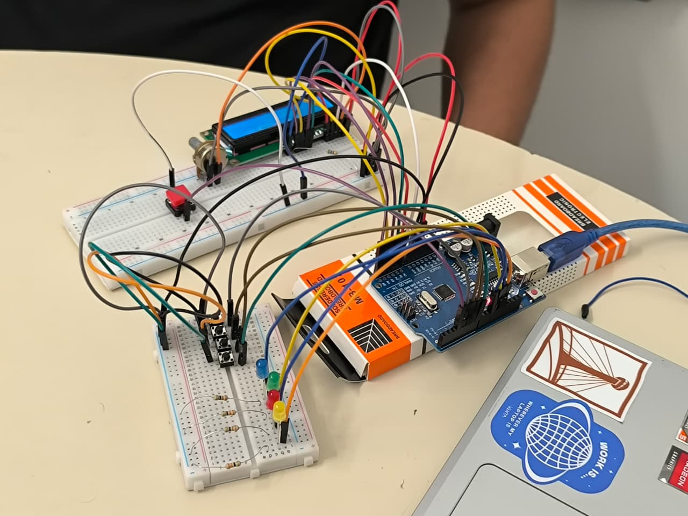
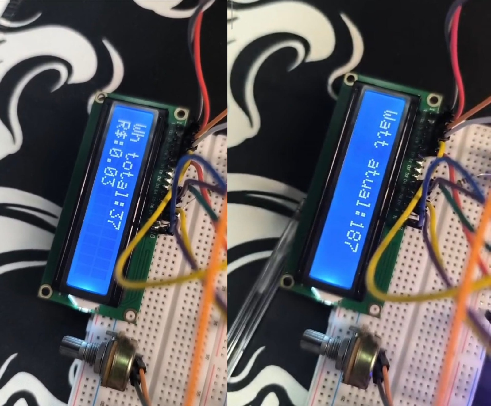

# ⚡ Monitor de Consumo de Energia – Arduino

Este projeto implementa um **monitor de consumo de energia** utilizando Arduino, display LCD 16x2, botões, LEDs e buzzer.  
O sistema simula o consumo de quatro eletrodomésticos, registra dados em CSV via Serial e permite visualização gráfica com Python/Jupyter.

---

<div align="center">
  
## 📸 Galeria do Projeto

<table>
  <tr>
    <td align="center" width="50%">
      
      <br />
      <sub><b>🔌 Circuito Completo</b></sub>
      <br />
      <sub>Montagem na protoboard com todos os componentes</sub>
    </td>
    <td align="center" width="50%">
      
      <br />
      <sub><b>📊 Display LCD em Ação</b></sub>
      <br />
      <sub>Medições de consumo e custo em tempo real</sub>
    </td>
  </tr>
</table>

</div>

---

## 📚 Recursos do Projeto

| Recurso | Descrição | Link |
|---------|-----------|------|
| 📊 **Apresentação** | Slides do projeto em PowerPoint | [Abrir Slide](./Monitor%20de%20consumo%20de%20energia.pptx) |
| 📄 **Relatório Completo** | Documentação técnica detalhada | [Abrir Relatório PDF](./Relatorio-Geral-Microcontroladores.pdf) |
| ⚙️ **Esquema Elétrico** | Diagrama de ligações do circuito | [Abrir Esquema PDF](./Esquema%20el%C3%A9trico.pdf) |
| 📈 **Gráficos e Análise** | Jupyter Notebook com visualizações | [Abrir Notebook](./graficos_arduino.ipynb) |
| 📦 **Dados de Exemplo** | CSV com medições simuladas | [Ver Dados](./monitor.csv.txt) |

---

## ✅ Funcionalidades

- Simulação de consumo de **4 eletrodomésticos** (Caixa de som, Ventilador, TV, Geladeira)
- Controle **liga/desliga** por botão para cada aparelho com indicação por LED
- **Display LCD 16x2** com duas telas alternáveis:
  - Tela 1: Consumo total (Wh) e custo (R$)
  - Tela 2: Potência instantânea (W)
- **Buzzer** ativo quando caixa de som está ligada
- **Registro em CSV** via Serial (9600 baud) com timestamp
- **Cálculo automático** de custo baseado em tarifa configurável
- **Análise gráfica** com Python (pandas/matplotlib)

---

## 🛠️ Componentes necessários

- Arduino Uno / Nano  
- Display LCD 16x2 (modo 4 bits)  
- 4 Botões tácteis  
- 4 LEDs + 4 resistores (≈220 Ω)  
- 1 Buzzer ativo  
- Jumpers e protoboard  
- Fonte 5V (USB) ou bateria  

---

## 📌 Ligações

### Display LCD 16x2

| Função | Pino Arduino |
|--------|--------------|
| RS     | A0           |
| EN     | A1           |
| D4     | A2           |
| D5     | A3           |
| D6     | A4           |
| D7     | A5           |

### Botões e LEDs dos Aparelhos

| Aparelho       | Botão | LED  |
|----------------|-------|------|
| Caixa de som   | D7    | D13  |
| Ventilador     | D6    | D12  |
| TV             | D5    | D11  |
| Geladeira      | D4    | D10  |

### Controles Adicionais

| Função              | Pino |
|---------------------|------|
| Botão alternância LCD | D3   |
| Buzzer              | D2   |

> **Nota:** Todos os botões usam `INPUT_PULLUP` (conectar ao GND ao pressionar).

---

## ⚙️ Como o código funciona

1. **Inicialização:** LCD exibe "Iniciando..." e Serial envia cabeçalho CSV
2. **Loop principal:**
   - Lê estado dos 4 botões (debounce por delay)
   - Atualiza LEDs conforme estado de cada aparelho
   - Ativa buzzer se caixa de som estiver ligada
3. **Cálculo de consumo** (a cada 5 segundos no modo teste):
   - Para cada aparelho ligado, gera valor aleatório na faixa de potência
   - Converte para Wh proporcional ao intervalo
   - Acumula no total e por aparelho
4. **Exibição:**
   - LCD atualiza a cada 1 segundo (alternável com botão D3)
   - Serial envia linha CSV com timestamp e todos os valores

---

## 📊 Tabela de Consumo Simulado

| Aparelho      | Potência Mínima | Potência Máxima |
|---------------|-----------------|-----------------|
| Caixa de som  | 2 W             | 60 W            |
| Ventilador    | 20 W            | 75 W            |
| TV            | 20 W            | 150 W           |
| Geladeira     | 80 W            | 300 W           |

---

## 🚀 Como usar

1. **Monte o circuito** conforme o [esquema elétrico](./Esquema%20el%C3%A9trico.pdf)
2. **Abra o código** `MONITOR_CONSUMO_ENERGIA_2.0/MONITOR_CONSUMO_ENERGIA_2.0.ino` no Arduino IDE
3. **Selecione** a placa (Uno/Nano) e porta COM correta
4. **Faça upload** do código
5. **Abra o Monitor Serial** (9600 baud) para visualizar os dados CSV
6. **Teste os botões:**
   - Pinos D7–D4: liga/desliga cada aparelho
   - Pino D3: alterna telas do LCD
7. **Copie os dados** do Serial para um arquivo `.csv` ou capture via script
8. **Execute o notebook** `graficos_arduino.ipynb` para ver os gráficos

> **Dica:** Ajuste `intervalo` de 5000 (5s) para 60000 (1 minuto) para simulação realista.

---

## 🧩 Funções principais

| Função | Descrição |
|--------|-----------|
| `PrintLcd(somaWh, custo, wattAtual)` | Exibe dados no LCD conforme tela selecionada |
| `PrintSerialCsv(agora, somaWh, custo)` | Envia linha formatada CSV para Serial |
| Loop de botões | Detecta transição HIGH→LOW com debounce |
| Cálculo de consumo | `wh = watt × (1/60)` para intervalos de 1 minuto |

---

## 📈 Visualização de Dados

O notebook `graficos_arduino.ipynb` gera 3 gráficos:

1. **Evolução temporal:** Consumo total (Wh) vs. Tempo
2. **Consumo por aparelho:** Gráfico de barras com Wh final de cada dispositivo
3. **Participação percentual:** Gráfico de pizza mostrando distribuição

**Exemplo de dados CSV:**
```
Tempo;TotalWh;CustoR$;CaixaSomWh;VentiladorWh;TVWh;GeladeiraWh
197;215.33;0.18;6.27;25.66;57.10;126.30
202;221.50;0.19;6.41;26.48;57.45;131.16
```

---

## ⚙️ Configurações do Código

Ajuste conforme necessário no arquivo `.ino`:

```cpp
// Tarifa de energia (R$/kWh) - Teresina + bandeira vermelha
const float tarifa = 0.84785;

// Intervalo de medição (ms)
const unsigned long intervalo = 5000UL;  // 5s (teste)
// const unsigned long intervalo = 60000UL; // 1min (real)

// Faixas de potência (W)
const float minWatt[4] = {2.0, 20.0, 20.0, 80.0};
const float maxWatt[4] = {60.0, 75.0, 150.0, 300.0};

// Nomes dos aparelhos
const char* deviceName[4] = {"Caixa de som", "Ventilador", "TV", "Geladeira"};
```

---

## 📁 Estrutura do Repositório

```
.
├── MONITOR_CONSUMO_ENERGIA_2.0/
│   └── MONITOR_CONSUMO_ENERGIA_2.0.ino    # Código principal do Arduino
├── Esquema elétrico.pdf                   # Diagrama do circuito
├── Monitor de consumo de energia.pptx     # Apresentação do projeto
├── Relatorio-Geral-Microcontroladores.pdf # Documentação técnica
├── graficos_arduino.ipynb                 # Notebook Python para gráficos
├── monitor.csv.txt                        # Exemplo de dados coletados
└── README.md                              # Este arquivo
```

---

## 🩺 Troubleshooting

| Problema | Solução |
|----------|---------|
| LCD sem caracteres | Ajuste o potenciômetro de contraste; verifique pinos A0–A5 |
| Botões não respondem | Confirme `INPUT_PULLUP` e conexão ao GND; adicione capacitor para debounce |
| Serial "bagunçado" | Verifique baud rate 9600 no Monitor Serial |
| Custos incorretos | Revise variável `tarifa` e conversão Wh→kWh |
| Buzzer sempre ligado | Verifique lógica `deviceState[0]` (caixa de som) |

---

## 🎓 Contexto Acadêmico

Projeto extensionista desenvolvido por alunos do **6º período de Ciência da Computação** da **Faculdade Estácio – Teresina** na disciplina de **Microcontroladores**.

**Objetivo:** Criar solução de monitoramento de consumo energético acessível e educativa, aplicando conceitos de eletrônica digital, programação embarcada e análise de dados.

---

## 📝 Licença

Este projeto é de código aberto para fins **educacionais e pessoais**.  
Sinta-se livre para modificar, estudar e compartilhar.

---

## 🔗 Links Úteis

- [Arduino Official](https://www.arduino.cc/)
- [LiquidCrystal Library](https://www.arduino.cc/reference/en/libraries/liquidcrystal/)
- [Pandas Documentation](https://pandas.pydata.org/)
- [Matplotlib Gallery](https://matplotlib.org/stable/gallery/index.html)
